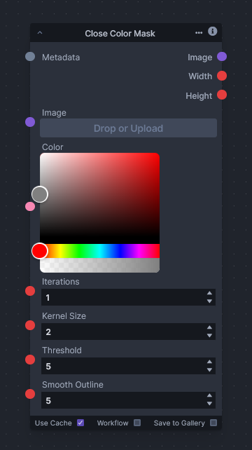

# Close Color Mask

The "Close Color Mask" node is an experimental tool crafted to assist with creating a mask around areas of an image that closely match a specified color. It utilizes color thresholding to target a specific hue, creating a foundational mask that represents areas with similar colors within a certain tolerance range.

This node employs the YCrCb color space for its ability to differentiate between color components more distinctly than the traditional RGB space. The algorithm defines an upper and lower bound for color tolerance, forming an initial rough mask. To refine the rough edges and reduce fragmentation, the node applies morphological operations such as dilation and erosion, followed by a Gaussian blur to smooth the mask’s outline.

It is important to note that the node might not always produce ideal results due to the inherent complexities associated with color segmentation in varied lighting conditions and diverse image backgrounds. Nonetheless, the node can still be of value for specific use cases where the color environment is controlled.
